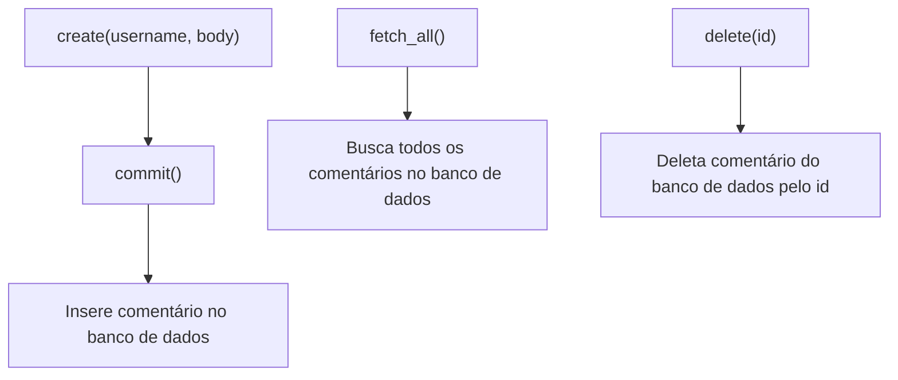
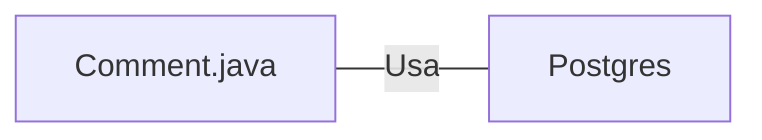

# Comment.java: Gerenciamento de Comentários

## Visão Geral
Este código é responsável pelo gerenciamento de comentários em uma aplicação. Ele permite a criação, recuperação e exclusão de comentários de um banco de dados PostgreSQL. Cada comentário é representado por um objeto `Comment` que contém um `id`, `username`, `body` e `created_on`.

## Fluxo do Processo

## Insights
- O método `create` é usado para criar um novo comentário. Ele gera um UUID para o comentário, cria um objeto `Comment` e tenta salvá-lo no banco de dados usando o método `commit`.
- O método `fetch_all` é usado para recuperar todos os comentários do banco de dados. Ele executa uma consulta SQL para buscar todos os comentários e retorna uma lista de objetos `Comment`.
- O método `delete` é usado para excluir um comentário do banco de dados pelo seu `id`. Ele executa uma consulta SQL para deletar o comentário e retorna um booleano indicando se a operação foi bem-sucedida.
- O método `commit` é usado para salvar um comentário no banco de dados. Ele executa uma consulta SQL para inserir o comentário e retorna um booleano indicando se a operação foi bem-sucedida.

## Dependências (Opcional)
O código depende da classe `Postgres` para estabelecer uma conexão com o banco de dados PostgreSQL.

- `Postgres` : Classe usada para estabelecer uma conexão com o banco de dados PostgreSQL. É chamada nos métodos `fetch_all`, `delete` e `commit`.

## Manipulação de Dados (SQL)
O código manipula a tabela `comments` no banco de dados PostgreSQL. A tabela tem a seguinte estrutura:

| Atributo   | Tipo de Dado | Descrição |
|------------|--------------|-----------|
| id         | String       | O identificador único do comentário. |
| username   | String       | O nome do usuário que fez o comentário. |
| body       | String       | O corpo do comentário. |
| created_on | Timestamp    | A data e hora em que o comentário foi criado. |

- `comments`: A tabela é usada para armazenar os comentários. As operações realizadas são INSERT (no método `commit`), SELECT (no método `fetch_all`) e DELETE (no método `delete`).

## Vulnerabilidades
- O código não verifica se o `username` ou `body` do comentário são nulos ou vazios antes de tentar salvá-los no banco de dados, o que pode levar a dados inválidos.
- O código não trata adequadamente as exceções SQL, apenas imprime a pilha de rastreamento e continua. Isso pode levar a comportamentos inesperados se ocorrer um erro ao interagir com o banco de dados.
- O código não fecha adequadamente as conexões, declarações e conjuntos de resultados do banco de dados em um bloco `finally`, o que pode levar a vazamentos de recursos.
