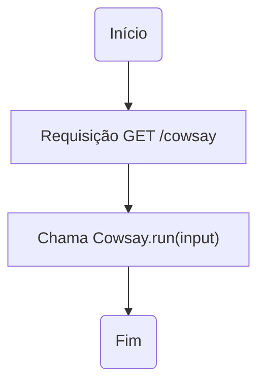
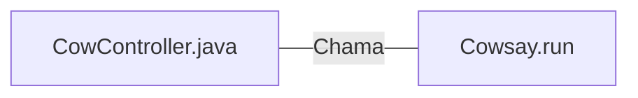

# CowController.java: Controlador de Vaca

## Visão Geral
O arquivo `CowController.java` é responsável por controlar as ações relacionadas à "vaca" em uma aplicação web. Ele define um endpoint REST (`/cowsay`) que aceita uma string como entrada e retorna a saída do método `Cowsay.run(input)`. O valor padrão para a entrada é "I love Linux!".

## Fluxo do Processo

## Insights
- O controlador define apenas um endpoint (`/cowsay`), que aceita uma string como parâmetro de entrada.
- O método `Cowsay.run(input)` é chamado com a entrada fornecida, e sua saída é retornada como resposta para a requisição.
- Se nenhum valor de entrada for fornecido, o valor padrão "I love Linux!" é usado.

## Dependências (Opcional)
O controlador depende da classe `Cowsay` e seu método `run(input)`. No entanto, o código para essa classe não é fornecido neste trecho de código.

- `Cowsay.run` : Método chamado pelo controlador com a entrada fornecida. Retorna uma string que é usada como resposta para a requisição.

## Manipulação de Dados (SQL) (Opcional)
Não há manipulação de dados SQL neste trecho de código.
