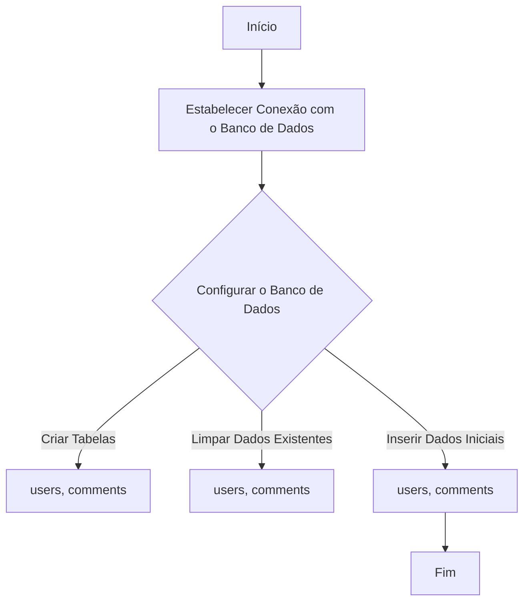
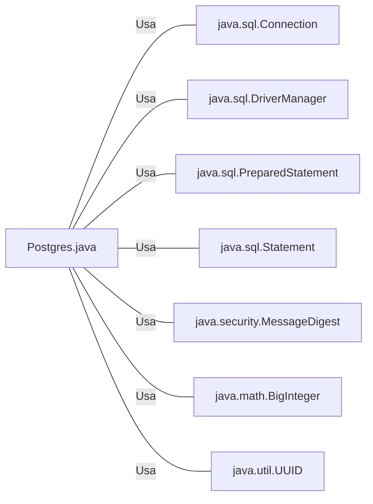

# Postgres.java: Configuração e Manipulação do Banco de Dados PostgreSQL

## Visão Geral
Este código é responsável pela configuração e manipulação de um banco de dados PostgreSQL. Ele contém métodos para estabelecer uma conexão com o banco de dados, configurar o esquema do banco de dados, inserir usuários e comentários e calcular o hash MD5 de uma string.

## Fluxo do Processo

## Insights
- O código utiliza a biblioteca `java.sql` para estabelecer uma conexão com o banco de dados PostgreSQL.
- As variáveis de ambiente `PGHOST`, `PGDATABASE`, `PGUSER` e `PGPASSWORD` são usadas para configurar a conexão com o banco de dados.
- Duas tabelas, `users` e `comments`, são criadas no banco de dados.
- Todos os dados existentes nas tabelas `users` e `comments` são excluídos antes da inserção de novos dados.
- O código insere dados iniciais nas tabelas `users` e `comments`.
- O código utiliza o algoritmo MD5 para calcular o hash das senhas dos usuários antes de inseri-las no banco de dados.

## Dependências (Opcional)

- `java.sql.Connection` : Usado para estabelecer uma conexão com o banco de dados.
- `java.sql.DriverManager` : Usado para gerenciar a conexão com o banco de dados.
- `java.sql.PreparedStatement` : Usado para preparar e executar consultas SQL.
- `java.sql.Statement` : Usado para executar consultas SQL estáticas.
- `java.security.MessageDigest` : Usado para calcular o hash MD5 das senhas dos usuários.
- `java.math.BigInteger` : Usado para converter o array de bytes do hash MD5 em uma representação de número inteiro.
- `java.util.UUID` : Usado para gerar um identificador único para cada usuário e comentário.

## Manipulação de Dados (SQL)
- `users`: Tabela que armazena os usuários. Os dados inseridos incluem o ID do usuário, nome de usuário, senha (em hash MD5), data de criação e última data de login.
- `comments`: Tabela que armazena os comentários. Os dados inseridos incluem o ID do comentário, nome de usuário, corpo do comentário e data de criação.

## Vulnerabilidades
- O código não implementa nenhum mecanismo de proteção contra ataques de injeção SQL. Isso pode permitir que um invasor execute consultas SQL arbitrárias.
- O código usa o algoritmo MD5 para o hash das senhas, que é considerado inseguro. Um invasor pode ser capaz de quebrar o hash e recuperar a senha original.
- O código não implementa nenhum mecanismo de proteção contra ataques de força bruta. Isso pode permitir que um invasor adivinhe a senha de um usuário.
- O código não implementa nenhum mecanismo de registro de logs. Isso pode dificultar a detecção e a investigação de atividades suspeitas ou maliciosas.
- O código não implementa nenhum mecanismo de autenticação ou autorização. Isso pode permitir que um invasor acesse ou modifique dados sem permissão.
