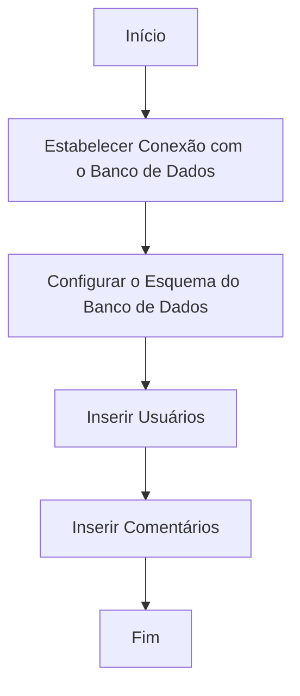
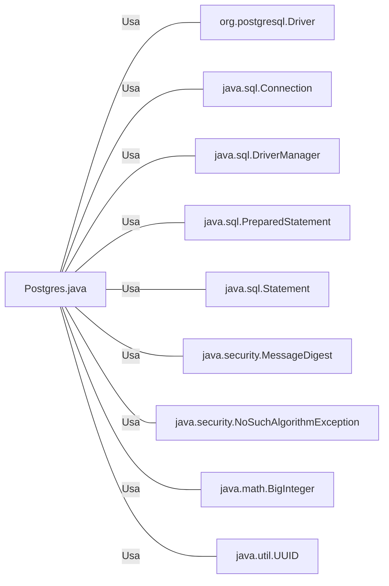

# Postgres.java: Configuração e Manipulação de Banco de Dados PostgreSQL

## Visão Geral

O arquivo `Postgres.java` é responsável por configurar e manipular um banco de dados PostgreSQL. Ele contém métodos para estabelecer uma conexão com o banco de dados, configurar o esquema do banco de dados, inserir usuários e comentários e calcular o hash MD5 de uma string.

## Fluxo do Processo

## Insights

- O método `connection()` estabelece uma conexão com o banco de dados PostgreSQL usando as variáveis de ambiente `PGHOST`, `PGDATABASE`, `PGUSER` e `PGPASSWORD`.
- O método `setup()` configura o esquema do banco de dados, cria as tabelas `users` e `comments` se elas não existirem, limpa quaisquer dados existentes e insere dados iniciais.
- Os métodos `insertUser()` e `insertComment()` são usados para inserir usuários e comentários, respectivamente, no banco de dados.
- O método `md5()` é usado para calcular o hash MD5 de uma string.

## Dependências (Opcional)

- `org.postgresql.Driver` : Driver JDBC para PostgreSQL, usado para estabelecer uma conexão com o banco de dados.
- `java.sql.Connection` : Interface que fornece métodos para interagir com o banco de dados.
- `java.sql.DriverManager` : Classe que gerencia um conjunto de drivers JDBC.
- `java.sql.PreparedStatement` : Interface que representa um comando SQL pré-compilado.
- `java.sql.Statement` : Interface usada para executar instruções SQL estáticas.
- `java.security.MessageDigest` : Classe que fornece funcionalidades de algoritmos de resumo de mensagem, como MD5 ou SHA.
- `java.security.NoSuchAlgorithmException` : Exceção lançada quando um algoritmo de criptografia específico não é encontrado.
- `java.math.BigInteger` : Classe usada para operações matemáticas com inteiros de precisão arbitrária.
- `java.util.UUID` : Classe que representa um identificador único universal (UUID).

## Manipulação de Dados (SQL) (Opcional)

- `users`: Tabela que armazena informações sobre os usuários. As operações SQL realizadas incluem a criação da tabela, a exclusão de todos os registros existentes e a inserção de novos registros.
- `comments`: Tabela que armazena informações sobre os comentários. As operações SQL realizadas incluem a criação da tabela, a exclusão de todos os registros existentes e a inserção de novos registros.

## Vulnerabilidades

- O código não faz uso de consultas parametrizadas ou declarações preparadas para prevenir ataques de injeção SQL.
- As senhas dos usuários são armazenadas como hashes MD5, que são considerados inseguros para armazenar senhas devido à sua vulnerabilidade a ataques de força bruta.
- O código não faz uso de sal para hashes de senha, tornando as senhas vulneráveis a ataques de dicionário e tabelas de arco-íris.
- As conexões de banco de dados e as declarações preparadas não são fechadas corretamente em um bloco finally, o que pode levar a vazamentos de recursos.
