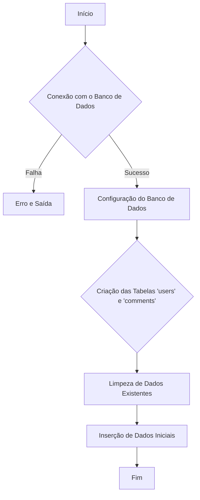
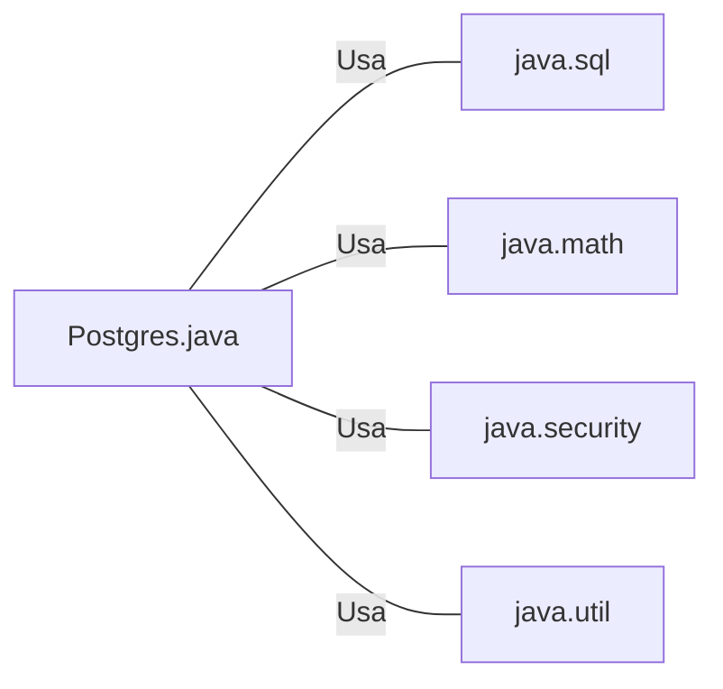

# Postgres.java: Gerenciador de Conexão e Configuração do Banco de Dados

## Visão Geral
O arquivo `Postgres.java` é responsável por estabelecer a conexão com o banco de dados PostgreSQL e configurar o esquema do banco de dados. Ele cria duas tabelas, `users` e `comments`, e insere dados iniciais nessas tabelas. Além disso, ele também fornece uma função para calcular o valor do hash SHA-256 de uma senha.

## Fluxo do Processo

## Insights
- O programa utiliza a biblioteca `java.sql` para estabelecer a conexão com o banco de dados e executar comandos SQL.
- As variáveis de ambiente `PGHOST`, `PGDATABASE`, `PGUSER` e `PGPASSWORD` são usadas para configurar a conexão com o banco de dados.
- O programa cria duas tabelas, `users` e `comments`, se elas não existirem.
- Todos os dados existentes nas tabelas `users` e `comments` são excluídos antes da inserção de novos dados.
- O programa insere dados iniciais nas tabelas `users` e `comments`.
- A função `hashPassword` é usada para calcular o valor do hash SHA-256 de uma senha.

## Dependências (Opcional)

- `java.sql`: Usado para estabelecer a conexão com o banco de dados e executar comandos SQL.
- `java.math`: Usado para manipular dados numéricos grandes.
- `java.security`: Usado para calcular o valor do hash SHA-256 de uma senha.
- `java.util`: Usado para gerar um identificador único para cada usuário e comentário.

## Manipulação de Dados (SQL) (Opcional)
- `users`: Tabela que armazena informações sobre os usuários. Os campos incluem `user_id`, `username`, `password`, `created_on` e `last_login`.
- `comments`: Tabela que armazena informações sobre os comentários feitos pelos usuários. Os campos incluem `id`, `username`, `body` e `created_on`.

## Vulnerabilidades
- O programa não implementa nenhum mecanismo de tratamento de erros adequado. Em caso de falha na conexão com o banco de dados, o programa simplesmente imprime a pilha de erros e sai.
- O programa não implementa nenhum mecanismo de autenticação ou autorização. Qualquer pessoa com acesso ao programa pode inserir, modificar ou excluir dados no banco de dados.
- O programa armazena senhas em texto simples no código-fonte, o que é uma prática insegura. Embora o programa calcule o valor do hash SHA-256 das senhas antes de armazená-las no banco de dados, o valor original da senha ainda pode ser obtido a partir do código-fonte.
- O programa não implementa nenhum mecanismo para proteger contra ataques de injeção SQL. Um invasor pode potencialmente inserir comandos SQL maliciosos para manipular os dados no banco de dados.
