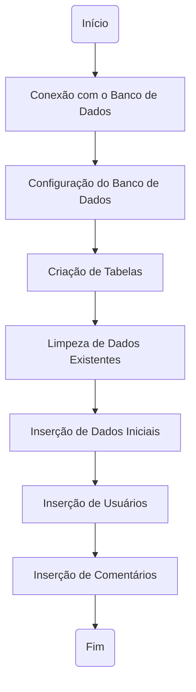
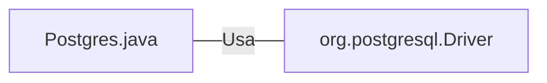

# Postgres.java: Configuração e Manipulação de Banco de Dados PostgreSQL

## Visão Geral
Este código é responsável pela configuração e manipulação de um banco de dados PostgreSQL. Ele estabelece uma conexão com o banco de dados, cria tabelas, insere dados iniciais e fornece funções para inserir usuários e comentários. Além disso, ele também contém uma função para calcular o valor do hash SHA-256 de uma senha.

## Fluxo do Processo

## Insights
- O código utiliza variáveis de ambiente para obter as credenciais e detalhes do banco de dados PostgreSQL.
- As tabelas 'users' e 'comments' são criadas se ainda não existirem.
- Todos os dados existentes nas tabelas 'users' e 'comments' são excluídos antes da inserção de novos dados.
- A senha do usuário é criptografada usando o algoritmo SHA-256 antes de ser inserida no banco de dados.
- Os IDs dos usuários e comentários são gerados usando o UUID.

## Dependências (Opcional)
- O código depende do driver JDBC do PostgreSQL para estabelecer uma conexão com o banco de dados.

- `org.postgresql.Driver` : Driver JDBC do PostgreSQL usado para estabelecer uma conexão com o banco de dados.

## Manipulação de Dados (SQL)
- `users`: Tabela que armazena os detalhes do usuário. Os detalhes incluem ID do usuário, nome de usuário, senha, data de criação e última data de login. As operações realizadas nesta tabela incluem CRIAÇÃO, EXCLUSÃO e INSERÇÃO.
- `comments`: Tabela que armazena os comentários dos usuários. Os detalhes incluem ID do comentário, nome de usuário, corpo do comentário e data de criação. As operações realizadas nesta tabela incluem CRIAÇÃO, EXCLUSÃO e INSERÇÃO.

## Vulnerabilidades
- O código não implementa nenhum mecanismo de tratamento de erros adequado. Em vez disso, ele simplesmente imprime a pilha de rastreamento e sai do sistema.
- O código não fecha explicitamente as conexões com o banco de dados, o que pode levar a vazamentos de conexão.
- O código usa a função hash SHA-256 para criptografar senhas, que não é considerada segura para armazenar senhas devido à sua vulnerabilidade a ataques de força bruta.
- O código não implementa nenhum mecanismo para proteger contra ataques de injeção SQL.
