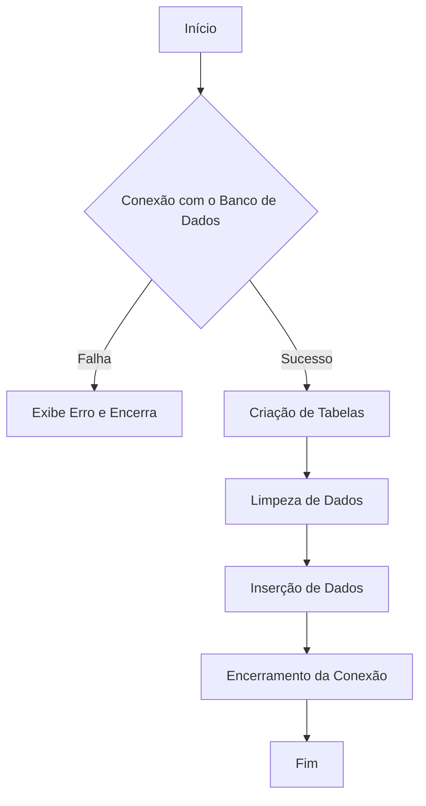
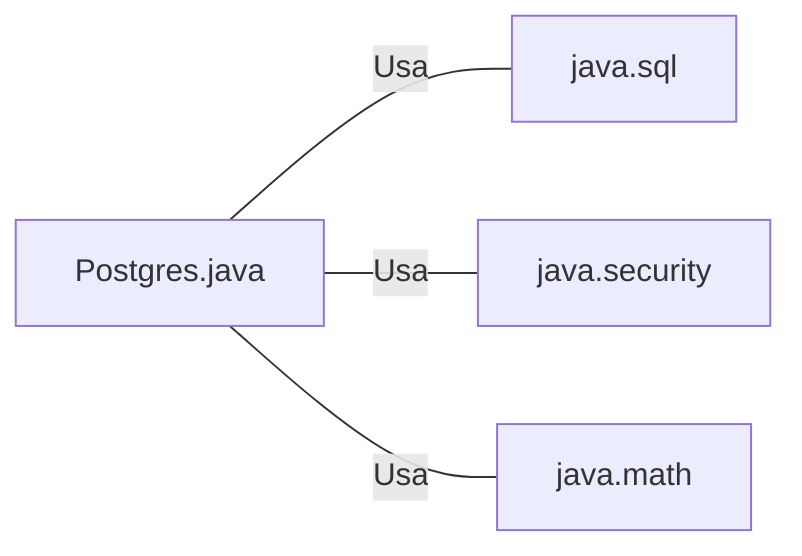

# Postgres.java: Gerenciamento de Conexão e Manipulação de Dados no PostgreSQL

## Visão Geral
Este código é responsável por estabelecer uma conexão com um banco de dados PostgreSQL, criar tabelas, inserir dados iniciais e manipular esses dados. Ele também contém uma função para calcular o valor de hash MD5 de uma string.

## Fluxo do Processo

## Insights
- O código utiliza a biblioteca `java.sql` para estabelecer uma conexão com o banco de dados PostgreSQL.
- As variáveis de ambiente `PGHOST`, `PGDATABASE`, `PGUSER` e `PGPASSWORD` são usadas para configurar a conexão com o banco de dados.
- Duas tabelas são criadas no banco de dados: `users` e `comments`.
- Todos os dados existentes nas tabelas `users` e `comments` são excluídos antes da inserção de novos dados.
- A função `md5` é usada para calcular o valor de hash MD5 de uma string, que é usada para armazenar senhas de forma segura.
- As funções `insertUser` e `insertComment` são usadas para inserir dados nas tabelas `users` e `comments`, respectivamente.

## Dependências (Opcional)
- Biblioteca `java.sql`: Usada para estabelecer uma conexão com o banco de dados PostgreSQL e manipular os dados.
- Biblioteca `java.security`: Usada para calcular o valor de hash MD5 de uma string.
- Biblioteca `java.math`: Usada para converter um array de bytes em uma representação de sinal.

- `java.sql`: Usada para estabelecer uma conexão com o banco de dados PostgreSQL e manipular os dados.
- `java.security`: Usada para calcular o valor de hash MD5 de uma string.
- `java.math`: Usada para converter um array de bytes em uma representação de sinal.

## Manipulação de Dados (SQL) (Opcional)
- `users`: Tabela que armazena informações dos usuários. As operações realizadas incluem a criação da tabela, exclusão de todos os dados existentes e inserção de novos dados.
- `comments`: Tabela que armazena comentários feitos pelos usuários. As operações realizadas incluem a criação da tabela, exclusão de todos os dados existentes e inserção de novos dados.

## Vulnerabilidades
- O código não implementa nenhum mecanismo de tratamento de exceções personalizado, o que pode levar a problemas de segurança e estabilidade.
- As senhas dos usuários são armazenadas como hashes MD5, que são considerados inseguros para armazenamento de senhas devido à sua vulnerabilidade a ataques de força bruta.
- As conexões ao banco de dados não são fechadas corretamente se ocorrer uma exceção durante a execução de uma instrução SQL, o que pode levar a vazamentos de recursos.
- O código não implementa nenhum mecanismo de log, o que pode dificultar a detecção e a solução de problemas.
