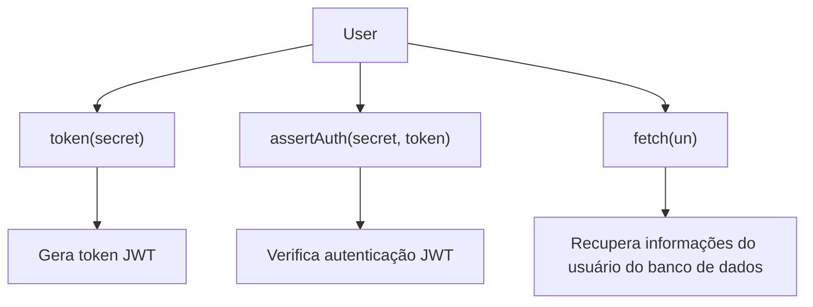
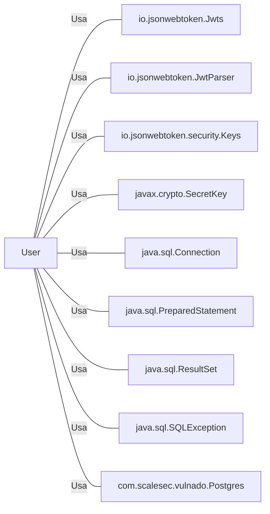

# User.java: Gerenciamento de Usuários

## Visão Geral
O código é responsável pelo gerenciamento de usuários em um sistema, incluindo a criação de tokens de autenticação, verificação de autenticação e recuperação de informações do usuário a partir de um banco de dados PostgreSQL.

## Fluxo do Processo

## Insights
- A classe `User` possui três atributos: `id`, `username` e `hashedPassword`.
- A classe `User` possui três métodos principais: `token()`, `assertAuth()` e `fetch()`.
- O método `token()` gera um token JWT para o usuário, que expira após uma hora.
- O método `assertAuth()` verifica a autenticação do token JWT.
- O método `fetch()` recupera as informações do usuário do banco de dados PostgreSQL.

## Dependências

- `io.jsonwebtoken.Jwts` : Utilizado para a criação de tokens JWT.
- `io.jsonwebtoken.JwtParser` : Utilizado para a verificação de tokens JWT.
- `io.jsonwebtoken.security.Keys` : Utilizado para a criação de chaves secretas para tokens JWT.
- `javax.crypto.SecretKey` : Utilizado para a criação de chaves secretas para tokens JWT.
- `java.sql.Connection` : Utilizado para estabelecer uma conexão com o banco de dados PostgreSQL.
- `java.sql.PreparedStatement` : Utilizado para preparar e executar consultas SQL.
- `java.sql.ResultSet` : Utilizado para armazenar o resultado de uma consulta SQL.
- `java.sql.SQLException` : Utilizado para lidar com exceções SQL.
- `com.scalesec.vulnado.Postgres` : Utilizado para estabelecer uma conexão com o banco de dados PostgreSQL.

## Manipulação de Dados (SQL)
- `users`: A tabela `users` é consultada para recuperar as informações do usuário. A operação SQL realizada é SELECT.

## Vulnerabilidades
- O código não implementa nenhum mecanismo de hashing ou salting para senhas, o que é uma prática de segurança recomendada para proteger as senhas dos usuários.
- O código não implementa nenhum mecanismo para lidar com tentativas de injeção SQL.
- O código não implementa nenhum mecanismo para lidar com usuários não encontrados no banco de dados, retornando simplesmente `null`.
- O código não implementa nenhum mecanismo para lidar com falhas na conexão com o banco de dados.
