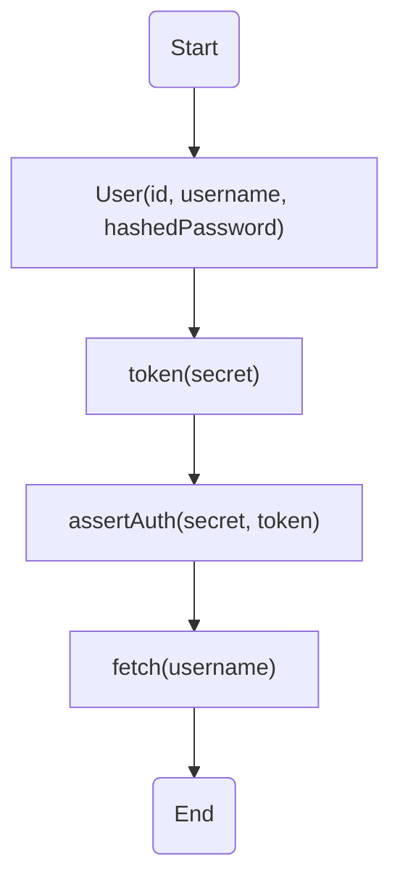
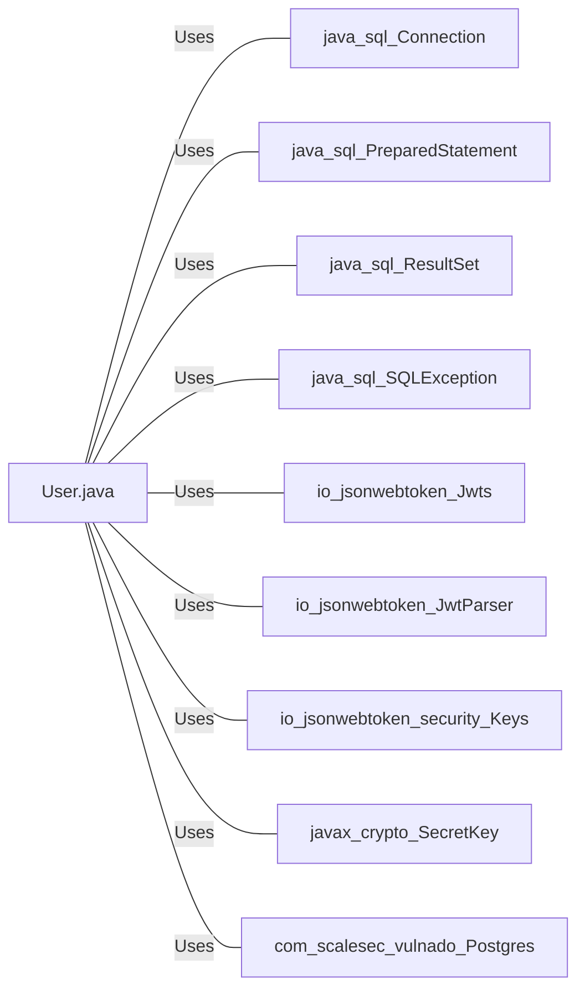

# User.java: User Authentication and Management

## Overview
The `User.java` class is responsible for managing user data and handling user authentication. It provides functionalities such as creating a user object, generating a token for a user, asserting user authentication, and fetching user data from a database.

## Process Flow

## Insights
- The `User` class has three attributes: `id`, `username`, and `hashedPassword`.
- The `token` method generates a JWT token for the user.
- The `assertAuth` method validates the provided JWT token.
- The `fetch` method retrieves a user from the database using the provided username.

## Dependencies
The `User` class has dependencies on the following external libraries and classes:
- `java.sql.Connection`
- `java.sql.PreparedStatement`
- `java.sql.ResultSet`
- `java.sql.SQLException`
- `io.jsonwebtoken.Jwts`
- `io.jsonwebtoken.JwtParser`
- `io.jsonwebtoken.security.Keys`
- `javax.crypto.SecretKey`
- `com.scalesec.vulnado.Postgres`

- `java.sql.Connection` : Used to establish a connection with the database.
- `java.sql.PreparedStatement` : Used to execute SQL queries.
- `java.sql.ResultSet` : Used to store the result of a database query.
- `java.sql.SQLException` : Exception thrown when there is an issue with SQL operations.
- `io.jsonwebtoken.Jwts` : Used to generate and parse JWT tokens.
- `io.jsonwebtoken.JwtParser` : Used to parse JWT tokens.
- `io.jsonwebtoken.security.Keys` : Used to generate secret keys for JWT tokens.
- `javax.crypto.SecretKey` : Represents a secret cryptographic key.
- `com.scalesec.vulnado.Postgres` : Used to get a connection to the Postgres database.

## Data Manipulation (SQL)
The `User` class interacts with the `users` table in the database. The table structure is as follows:

| Attribute  | Type   | Description                  |
|------------|--------|------------------------------|
| user_id    | String | The unique identifier of the user |
| username   | String | The username of the user     |
| password   | String | The hashed password of the user |

- `users`: The `fetch` method retrieves a user from the `users` table using a SELECT SQL operation. The username is used as the parameter for the query.
