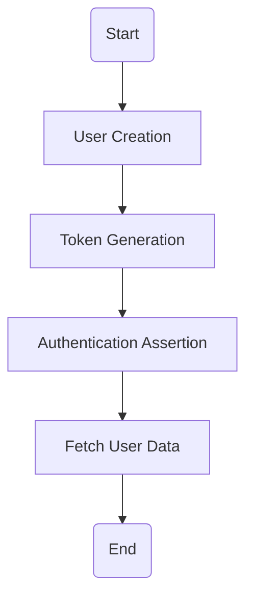
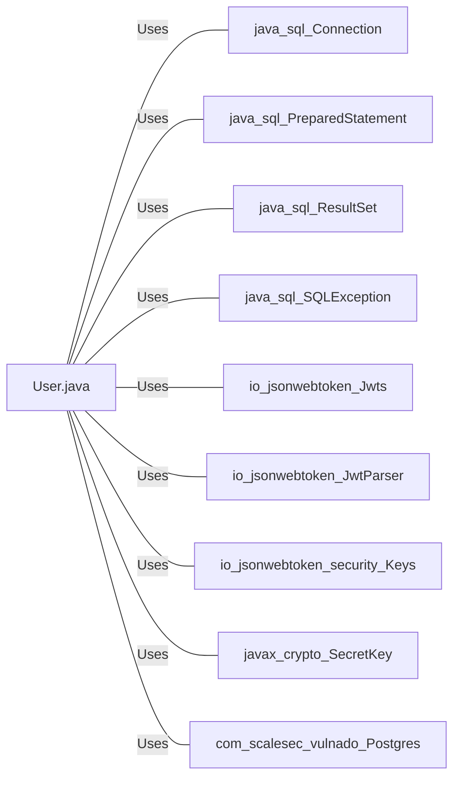

# User.java: User Authentication and Management

## Overview
The `User.java` class is responsible for managing user data and handling user authentication. It provides functionalities such as creating a new user, generating a token for a user, asserting user authentication, and fetching user data from a database.

## Process Flow

## Insights
- The `User` class has three attributes: `id`, `username`, and `hashedPassword`.
- The `User` constructor initializes these attributes.
- The `token` method generates a JWT token for a user.
- The `assertAuth` method validates the provided JWT token.
- The `fetch` method retrieves a user from the database using the username.

## Dependencies
The `User` class has dependencies on the following external libraries and classes:

- `java.sql.Connection`
- `java.sql.PreparedStatement`
- `java.sql.ResultSet`
- `java.sql.SQLException`
- `io.jsonwebtoken.Jwts`
- `io.jsonwebtoken.JwtParser`
- `io.jsonwebtoken.security.Keys`
- `javax.crypto.SecretKey`
- `com.scalesec.vulnado.Postgres`

- `java.sql.Connection` : Used to establish a connection with the database.
- `java.sql.PreparedStatement` : Used to execute SQL queries.
- `java.sql.ResultSet` : Represents the result set of a database query.
- `java.sql.SQLException` : Provides information on database access errors.
- `io.jsonwebtoken.Jwts` : Used to build and parse JWTs.
- `io.jsonwebtoken.JwtParser` : Used to parse JWTs.
- `io.jsonwebtoken.security.Keys` : Used to generate secret keys for JWTs.
- `javax.crypto.SecretKey` : Represents a secret cryptographic key.
- `com.scalesec.vulnado.Postgres` : Used to get a database connection.

## Data Manipulation (SQL)
The `User` class interacts with the `users` table in the database. The table structure is not explicitly defined in the code, but it can be inferred that it has at least the following columns: `user_id`, `username`, and `password`.

- `users`: The `fetch` method retrieves a user from this table using the `username`. The SQL operation performed is `SELECT`.

## Vulnerabilities
The `User` class has a potential security vulnerability:

- The `fetch` method retrieves user data from the database and returns a `User` object with the user's password. This could potentially expose sensitive user data. It is generally a bad practice to handle passwords directly. Instead, consider using hashed or encrypted passwords.
