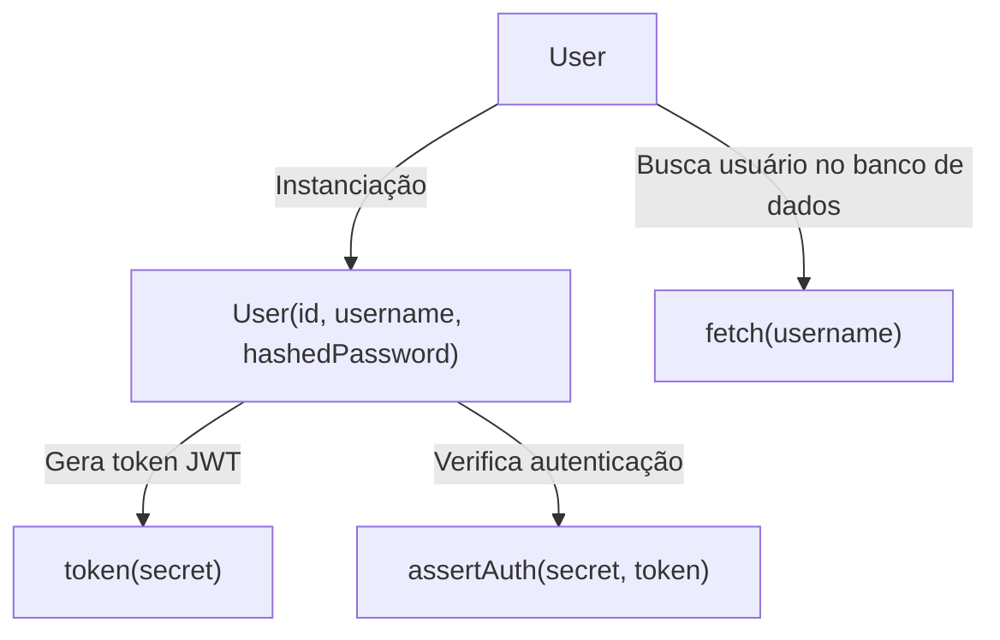
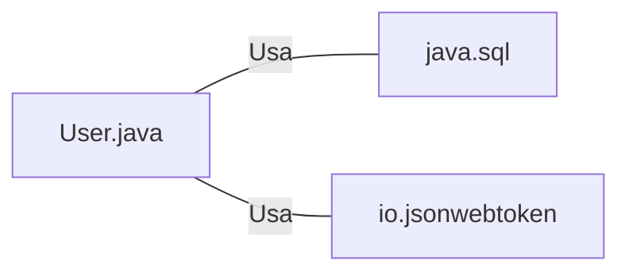

# User.java: Gerenciamento de Usuários

## Visão Geral
O código é responsável pelo gerenciamento de usuários em um sistema, incluindo a criação de tokens de autenticação, verificação de autenticação e recuperação de informações do usuário a partir de um banco de dados PostgreSQL.

## Fluxo do Processo

## Insights
- A classe `User` representa um usuário no sistema, com atributos para `id`, `username` e `hashedPassword`.
- O método `token` gera um token JWT para o usuário, que pode ser usado para autenticação.
- O método `assertAuth` verifica se um token JWT é válido.
- O método `fetch` busca um usuário no banco de dados PostgreSQL pelo nome de usuário.

## Dependências
O código depende das seguintes bibliotecas externas:
- `java.sql`: para conexão com o banco de dados e execução de consultas SQL.
- `io.jsonwebtoken`: para geração e verificação de tokens JWT.

- `java.sql`: Usado para estabelecer uma conexão com o banco de dados PostgreSQL e executar consultas SQL.
- `io.jsonwebtoken`: Usado para gerar e verificar tokens JWT para autenticação de usuários.

## Manipulação de Dados (SQL)
O código executa uma consulta SQL para buscar um usuário no banco de dados PostgreSQL. A tabela `users` é consultada e os dados do usuário são recuperados com base no nome de usuário.

- `users`: A consulta SQL seleciona todos os campos de um usuário onde o nome de usuário corresponde ao fornecido. A consulta é limitada a um resultado.

## Vulnerabilidades
- O método `fetch` está vulnerável a ataques de injeção SQL, pois a consulta SQL é construída concatenando diretamente a entrada do usuário. Um usuário mal-intencionado pode fornecer uma entrada que altera a consulta SQL de maneiras indesejadas.
- O código não verifica se a consulta SQL no método `fetch` retorna um resultado antes de tentar usar esse resultado. Isso pode levar a exceções em tempo de execução se a consulta não retornar nenhum resultado.
- O código não trata adequadamente as exceções. Ele simplesmente imprime a pilha de rastreamento e continua a execução. Isso pode levar a comportamentos inesperados e dificultar a depuração.
