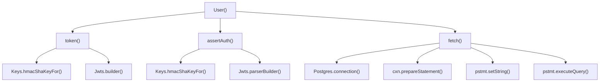
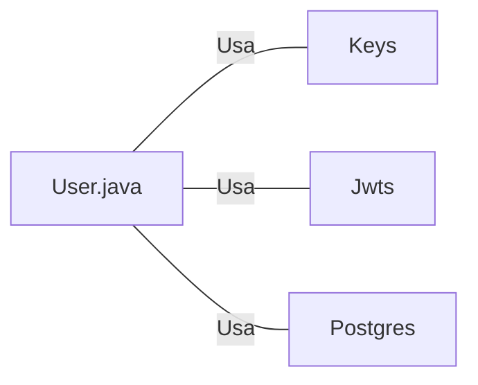

# User.java: Gerenciamento de Usuários e Autenticação

## Visão Geral
O código em questão é responsável pelo gerenciamento de usuários e autenticação em uma aplicação Java. Ele define a estrutura de dados para um usuário e fornece métodos para gerar tokens de autenticação, validar tokens e buscar usuários em um banco de dados PostgreSQL.

## Fluxo do Processo

## Insights
- A classe `User` define a estrutura de dados para um usuário, que inclui um `id`, `username` e `hashedPassword`.
- O método `token()` é usado para gerar um token de autenticação JWT para o usuário. Ele usa a biblioteca `Jwts` para construir o token.
- O método `assertAuth()` é usado para validar um token de autenticação JWT. Ele também usa a biblioteca `Jwts` para analisar o token.
- O método `fetch()` é usado para buscar um usuário do banco de dados PostgreSQL. Ele usa a classe `Postgres` para estabelecer uma conexão com o banco de dados e executar a consulta SQL.

## Dependências

- `Keys` : Usado para gerar uma chave secreta para a assinatura do token JWT.
- `Jwts` : Usado para construir e analisar tokens JWT.
- `Postgres` : Usado para estabelecer uma conexão com o banco de dados PostgreSQL e executar consultas SQL.

## Manipulação de Dados (SQL)
- `users`: A tabela `users` é consultada para buscar um usuário pelo seu nome de usuário. A consulta SQL é executada usando o método `executeQuery()` do objeto `PreparedStatement`.

## Vulnerabilidades
- O método `fetch()` pode estar vulnerável a ataques de injeção SQL, pois utiliza a entrada do usuário diretamente na consulta SQL. Recomenda-se o uso de consultas parametrizadas para prevenir essa vulnerabilidade.
- O método `assertAuth()` lança uma exceção genérica `Unauthorized` quando ocorre um erro ao analisar o token JWT. Isso pode levar a vazamento de informações se a mensagem da exceção contiver detalhes sobre a implementação interna do sistema.
- O método `token()` define um tempo de expiração fixo para o token JWT. Isso pode não ser adequado para todos os cenários de uso, pois diferentes usuários ou sessões podem exigir diferentes tempos de expiração.
