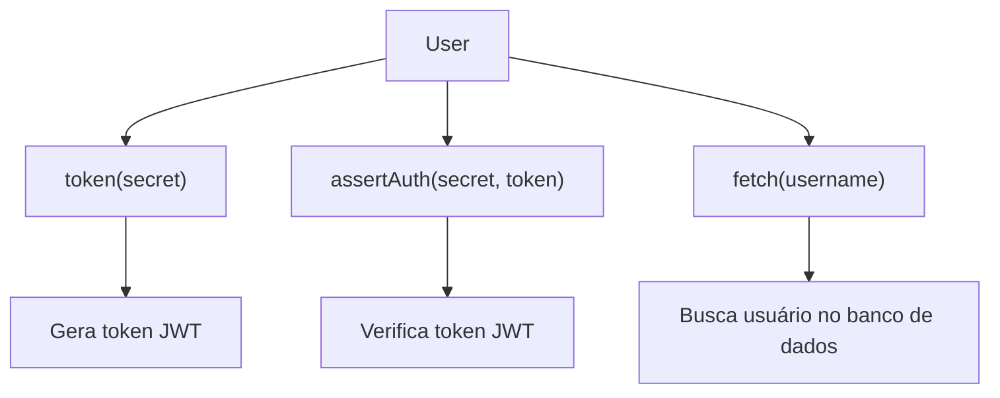
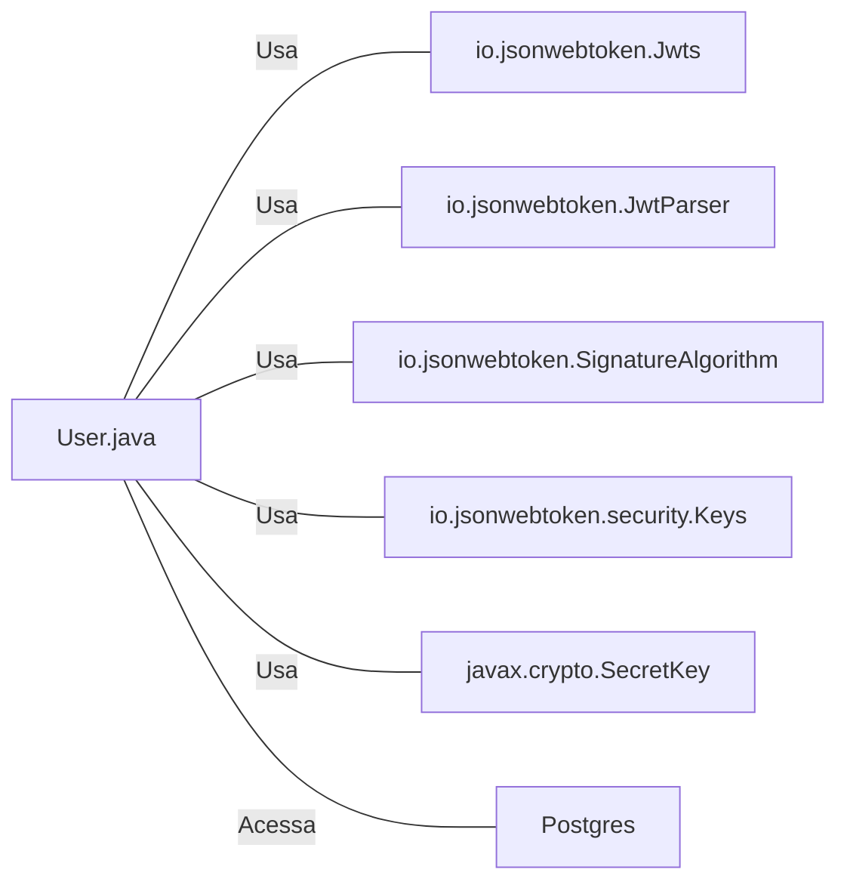

# User.java: Gerenciamento de Usuários

## Visão Geral
O código é responsável pelo gerenciamento de usuários em um sistema, incluindo a criação de tokens de autenticação, verificação de autenticação e recuperação de informações do usuário a partir de um banco de dados PostgreSQL.

## Fluxo do Processo

## Insights
- A classe `User` possui três atributos: `id`, `username` e `hashedPassword`.
- A classe `User` possui três métodos principais: `token`, `assertAuth` e `fetch`.
- O método `token` gera um token JWT para o usuário.
- O método `assertAuth` verifica a autenticidade de um token JWT.
- O método `fetch` recupera um usuário do banco de dados PostgreSQL.
- A senha do usuário é armazenada como um hash.

## Dependências

- `io.jsonwebtoken.Jwts` : Usado para construir e verificar tokens JWT.
- `io.jsonwebtoken.JwtParser` : Usado para analisar tokens JWT.
- `io.jsonwebtoken.SignatureAlgorithm` : Usado para definir o algoritmo de assinatura para o token JWT.
- `io.jsonwebtoken.security.Keys` : Usado para gerar a chave de assinatura para o token JWT.
- `javax.crypto.SecretKey` : Usado para representar a chave de assinatura para o token JWT.
- `Postgres` : Classe que fornece a conexão com o banco de dados PostgreSQL.

## Vulnerabilidades
- O método `fetch` está vulnerável a ataques de injeção SQL, pois a consulta SQL é construída concatenando diretamente a entrada do usuário (`un`), sem qualquer sanitização ou uso de consultas preparadas.
- O método `assertAuth` imprime a pilha de exceções completa quando ocorre uma falha de autenticação. Isso pode expor detalhes sensíveis do sistema e facilitar ataques.

## Manipulação de Dados (SQL)
- `users`: A tabela `users` é acessada para recuperar informações do usuário. A operação SQL realizada é SELECT.
