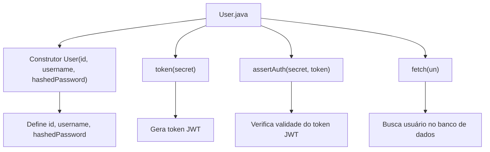
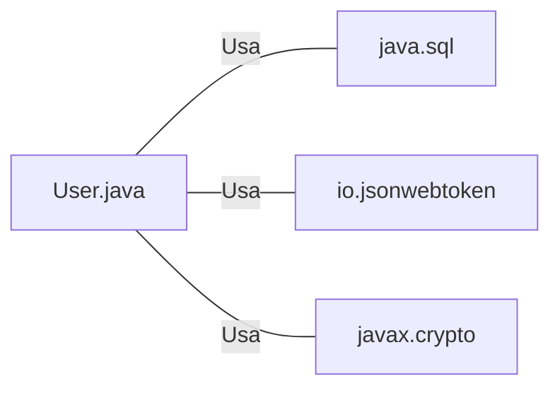

# User.java: Gerenciamento de Usuários

## Visão Geral
O código é responsável pelo gerenciamento de usuários em um sistema, incluindo a criação de tokens de autenticação, verificação de autenticação e recuperação de informações do usuário a partir de um banco de dados PostgreSQL.

## Fluxo do Processo

## Insights
- A classe `User` representa um usuário no sistema, com `id`, `username` e `hashedPassword` como atributos.
- A função `token` gera um token JWT para o usuário, usando a chave secreta fornecida.
- A função `assertAuth` verifica a validade de um token JWT, lançando uma exceção `Unauthorized` se o token for inválido.
- A função `fetch` recupera um usuário do banco de dados PostgreSQL, usando o nome de usuário fornecido.

## Dependências
O código depende das seguintes bibliotecas externas:
- `java.sql`: para conexão com o banco de dados e execução de consultas SQL.
- `io.jsonwebtoken`: para geração e verificação de tokens JWT.
- `javax.crypto`: para geração de chaves secretas para tokens JWT.

- `java.sql`: Usado para estabelecer uma conexão com o banco de dados e executar consultas SQL.
- `io.jsonwebtoken`: Usado para gerar e verificar tokens JWT.
- `javax.crypto`: Usado para gerar chaves secretas para tokens JWT.

## Manipulação de Dados (SQL)
A entidade manipulada pelo código é a tabela `users` no banco de dados PostgreSQL.

- `users`: A consulta SQL seleciona um usuário da tabela `users` onde o nome de usuário corresponde ao fornecido. A consulta retorna o primeiro usuário que corresponde ao critério.

## Vulnerabilidades
O código apresenta uma vulnerabilidade de injeção de SQL na função `fetch`. A consulta SQL é construída concatenando diretamente a entrada do usuário (`un`), o que permite que um atacante insira comandos SQL maliciosos. Uma solução seria usar consultas preparadas para evitar essa vulnerabilidade.
