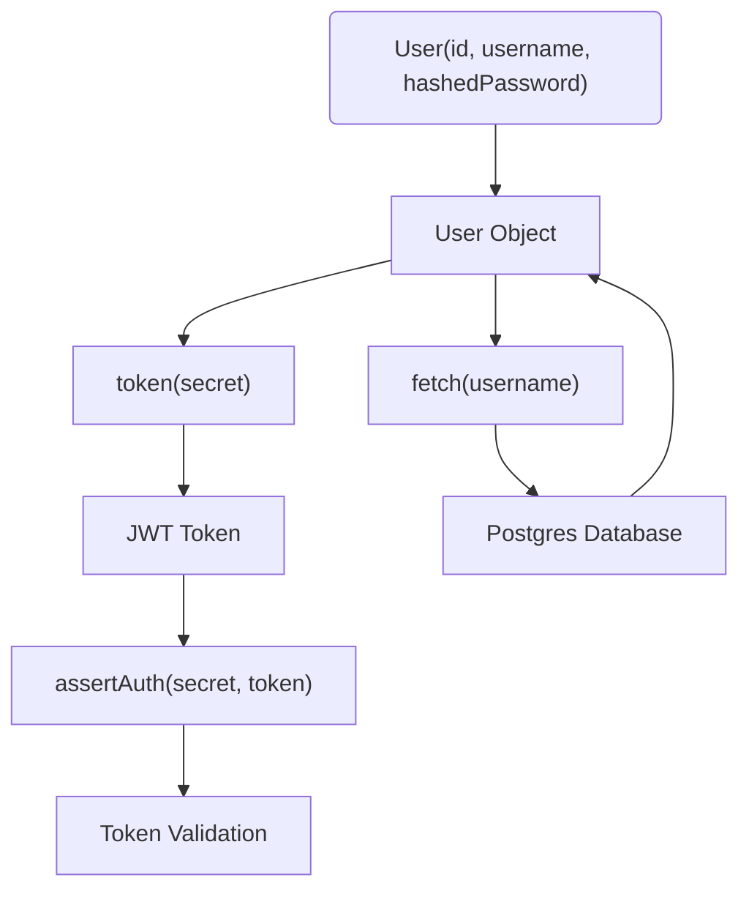
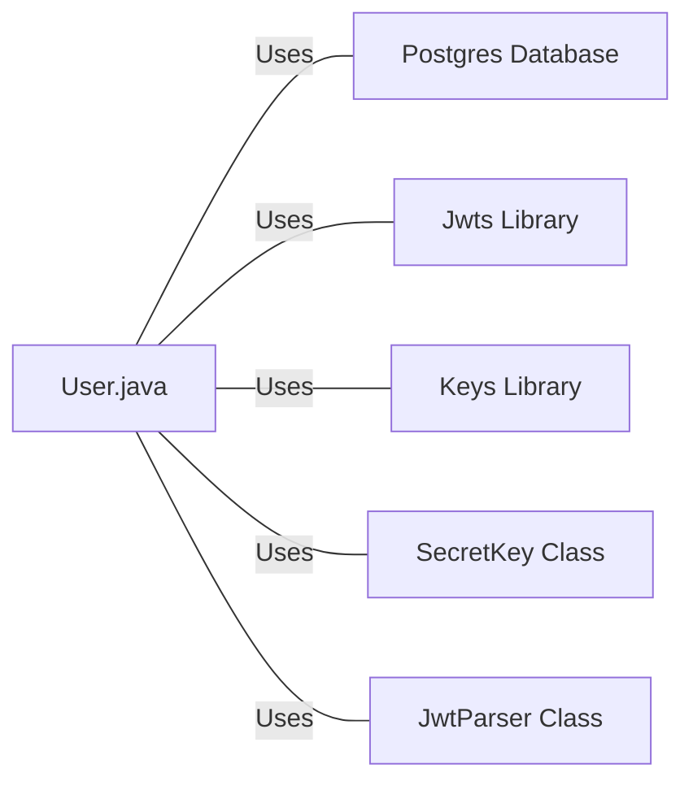

# User.java: User Authentication and Management

## Overview
The `User.java` class is responsible for managing user data and handling user authentication. It provides functionalities such as creating a user object, generating a token for a user, asserting user authentication, and fetching user data from a database.

## Process Flow

## Insights
- The `User` class has three attributes: `id`, `username`, and `hashedPassword`.
- The `User` constructor initializes a `User` object with `id`, `username`, and `hashedPassword`.
- The `token` method generates a JWT token for the user, which is valid for one hour.
- The `assertAuth` method validates the provided JWT token. If the token is invalid, it throws an `Unauthorized` exception.
- The `fetch` method retrieves a user from the Postgres database using the provided username. If the user is not found or an error occurs, it returns `null`.

## Dependencies (Optional)

- `Postgres` : The Postgres database is used to fetch user data. The `fetch` method prepares a SQL query to retrieve a user with a specific username.
- `Jwts` : The Jwts library is used to generate and parse JWT tokens.
- `Keys` : The Keys library is used to generate a SecretKey from a provided secret string.
- `SecretKey` : The SecretKey class is used to hold the secret key for JWT token generation and validation.
- `JwtParser` : The JwtParser class is used to parse and validate JWT tokens.

## Data Manipulation (SQL) (Optional)
- `users`: The `fetch` method performs a SELECT operation on the `users` table to retrieve a user with a specific username. The SQL query is "SELECT * FROM users WHERE username = ? LIMIT 1".

## Vulnerabilities
- The `fetch` method returns `null` when an SQL exception occurs or when a user is not found. This could lead to Null Pointer Exceptions in the code that calls this method.
- The `assertAuth` method prints the stack trace of the exception to the standard error, which could expose sensitive information about the system.
- The `token` method generates a JWT token that is valid for one hour. If the secret key is compromised, an attacker could generate valid tokens for any user within this time frame.
