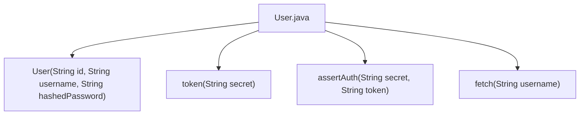
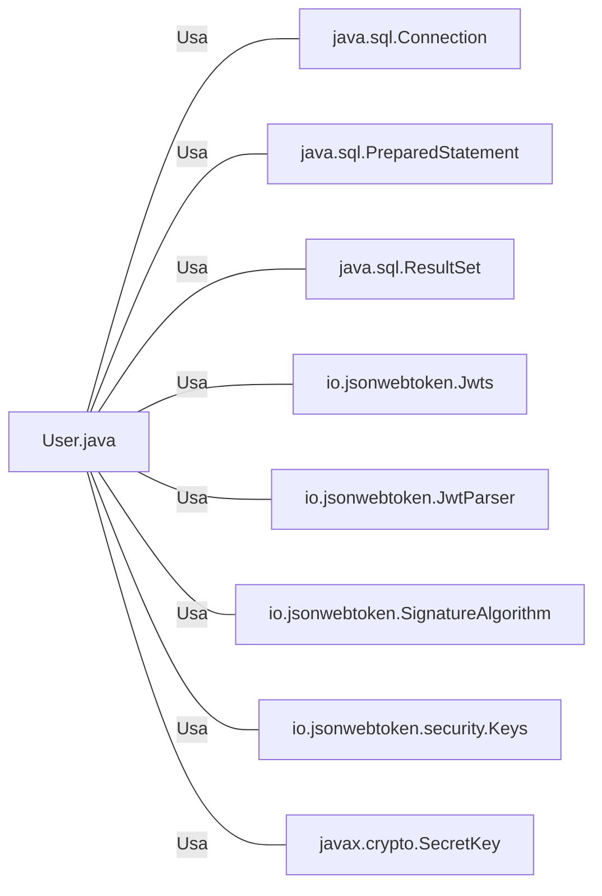

# User.java: Gerenciamento de Usuários

## Visão Geral
O código é responsável pelo gerenciamento de usuários em um sistema. Ele fornece funcionalidades para autenticação de usuários, geração de tokens JWT, e busca de usuários no banco de dados.

## Fluxo do Processo

## Insights
- A classe `User` possui três atributos: `id`, `username` e `hashedPassword`.
- O método `token(String secret)` gera um token JWT para o usuário.
- O método `assertAuth(String secret, String token)` verifica a autenticidade de um token JWT.
- O método `fetch(String username)` busca um usuário no banco de dados Postgres.

## Dependências
O código depende das seguintes bibliotecas externas:
- `java.sql.Connection`
- `java.sql.PreparedStatement`
- `java.sql.ResultSet`
- `io.jsonwebtoken.Jwts`
- `io.jsonwebtoken.JwtParser`
- `io.jsonwebtoken.SignatureAlgorithm`
- `io.jsonwebtoken.security.Keys`
- `javax.crypto.SecretKey`

- `java.sql.Connection` : Usado para estabelecer uma conexão com o banco de dados Postgres.
- `java.sql.PreparedStatement` : Usado para preparar e executar consultas SQL.
- `java.sql.ResultSet` : Usado para armazenar o resultado de uma consulta SQL.
- `io.jsonwebtoken.Jwts` : Usado para construir e validar tokens JWT.
- `io.jsonwebtoken.JwtParser` : Usado para analisar tokens JWT.
- `io.jsonwebtoken.SignatureAlgorithm` : Usado para definir o algoritmo de assinatura para tokens JWT.
- `io.jsonwebtoken.security.Keys` : Usado para gerar chaves secretas para tokens JWT.
- `javax.crypto.SecretKey` : Usado para representar uma chave secreta.

## Manipulação de Dados (SQL)
A estrutura da tabela `users` manipulada pelo código é a seguinte:

| Nome do Atributo | Tipo de Dados | Descrição |
|------------------|---------------|-----------|
| user_id          | String        | ID do usuário |
| username         | String        | Nome de usuário |
| password         | String        | Senha do usuário (criptografada) |

- `users`: A tabela `users` é consultada para buscar um usuário pelo nome de usuário.

## Vulnerabilidades
- O código não implementa nenhum mecanismo de hashing ou salting para senhas, o que pode levar a vulnerabilidades de segurança se as senhas dos usuários forem comprometidas.
- O código não implementa nenhum mecanismo para lidar com tentativas de injeção SQL, o que pode levar a vulnerabilidades de segurança.
- O código não implementa nenhum mecanismo para lidar com usuários não encontrados, o que pode levar a erros de tempo de execução.
