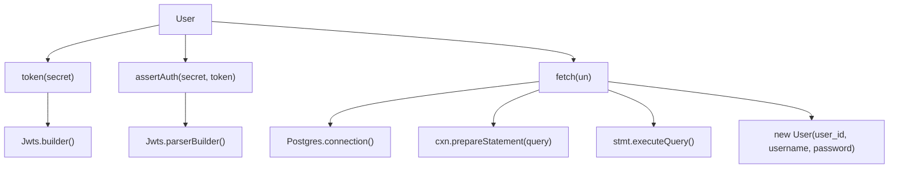
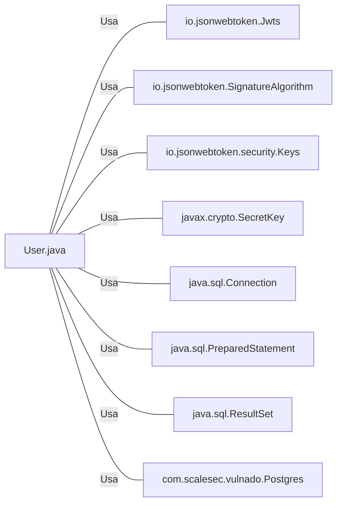

# User.java: Gerenciamento de Usuários

## Visão Geral
O código é responsável pelo gerenciamento de usuários em um sistema, incluindo a criação de tokens de autenticação, verificação de autenticação e recuperação de informações do usuário a partir de um banco de dados PostgreSQL.

## Fluxo do Processo

## Insights
- A classe `User` possui três atributos: `id`, `username` e `hashedPassword`.
- A classe `User` possui três métodos: `token()`, `assertAuth()` e `fetch()`.
- O método `token()` gera um token JWT para o usuário.
- O método `assertAuth()` verifica a autenticidade de um token JWT.
- O método `fetch()` recupera um usuário do banco de dados PostgreSQL.
- A classe `User` interage com a biblioteca `io.jsonwebtoken` para gerar e verificar tokens JWT.
- A classe `User` interage com a classe `Postgres` para estabelecer uma conexão com o banco de dados.

## Dependências (Opcional)

- `io.jsonwebtoken.Jwts` : Usado para gerar e verificar tokens JWT.
- `io.jsonwebtoken.SignatureAlgorithm` : Usado para definir o algoritmo de assinatura do token JWT.
- `io.jsonwebtoken.security.Keys` : Usado para gerar a chave de assinatura do token JWT.
- `javax.crypto.SecretKey` : Usado para representar a chave de assinatura do token JWT.
- `java.sql.Connection` : Usado para estabelecer uma conexão com o banco de dados.
- `java.sql.PreparedStatement` : Usado para preparar e executar consultas SQL.
- `java.sql.ResultSet` : Usado para armazenar o resultado de uma consulta SQL.
- `com.scalesec.vulnado.Postgres` : Usado para estabelecer uma conexão com o banco de dados PostgreSQL.

## Manipulação de Dados (SQL) (Opcional)

- `users`: A tabela `users` é consultada para recuperar um usuário com base no nome de usuário. A operação SQL realizada é SELECT.

## Vulnerabilidades
- O código não implementa a proteção contra ataques de injeção SQL. O nome de usuário é inserido diretamente na consulta SQL no método `fetch()`, o que pode permitir a um invasor executar consultas SQL arbitrárias.
- O código não implementa o hash de senhas. As senhas são armazenadas em texto simples no banco de dados, o que é uma prática insegura. Se o banco de dados for comprometido, todas as senhas dos usuários serão expostas.
- O código não implementa o tratamento adequado de exceções. As exceções são simplesmente impressas na saída padrão e não são lançadas novamente. Isso pode levar a comportamentos inesperados e dificultar a depuração.
