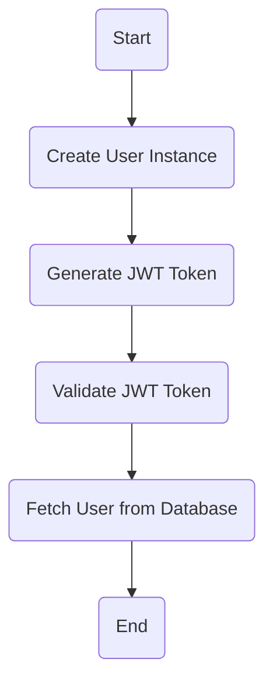
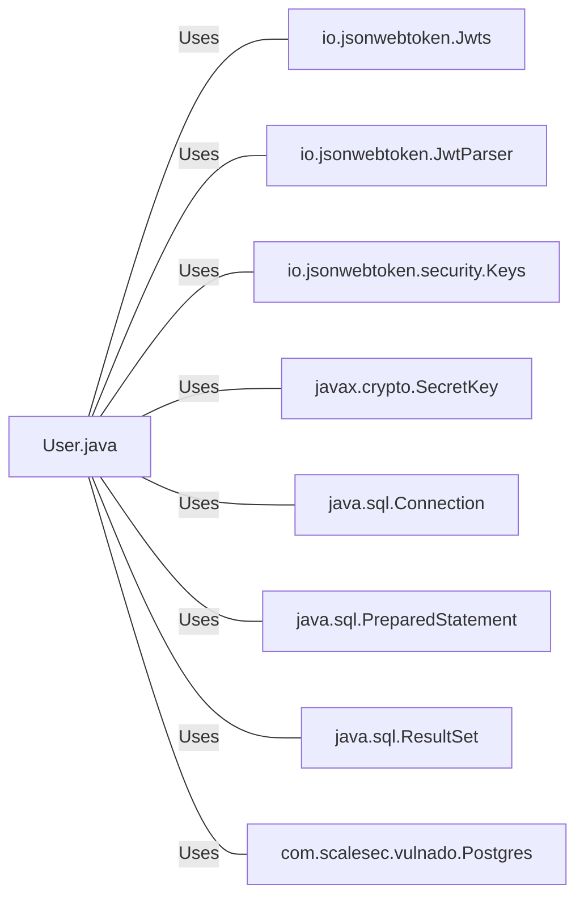

# User.java: User Authentication and Management

## Overview
The `User.java` class is responsible for managing user data and handling user authentication. It provides methods for generating and validating JWT tokens, fetching user data from a PostgreSQL database, and creating a new user instance.

## Process Flow

## Insights
- The `User` class has three attributes: `id`, `username`, and `hashedPassword`.
- The `token` method generates a JWT token for the user instance.
- The `assertAuth` method validates a given JWT token.
- The `fetch` method retrieves a user from the PostgreSQL database using the username.

## Dependencies (Optional)
The `User.java` class has dependencies on the following external libraries and classes:

- `io.jsonwebtoken.Jwts` : Used to build and sign JWT tokens.
- `io.jsonwebtoken.JwtParser` : Used to parse and validate JWT tokens.
- `io.jsonwebtoken.security.Keys` : Used to generate a SecretKey for signing JWT tokens.
- `javax.crypto.SecretKey` : Represents a cryptographic secret key.
- `java.sql.Connection` : Represents a connection with a specific database.
- `java.sql.PreparedStatement` : Represents a precompiled SQL statement.
- `java.sql.ResultSet` : Represents a database result set generated by executing a statement that queries the database.
- `com.scalesec.vulnado.Postgres` : Represents the PostgreSQL database connection.

## Data Manipulation (SQL) (Optional)
- `users`: The `fetch` method executes a SELECT query on the `users` table to retrieve a user with a specific username.

## Vulnerabilities
- The `fetch` method returns `null` when an `SQLException` is caught. This could lead to Null Pointer Exceptions in the code that calls this method.
- The `assertAuth` method prints the stack trace of exceptions to the standard error, which could expose sensitive information about the system.
