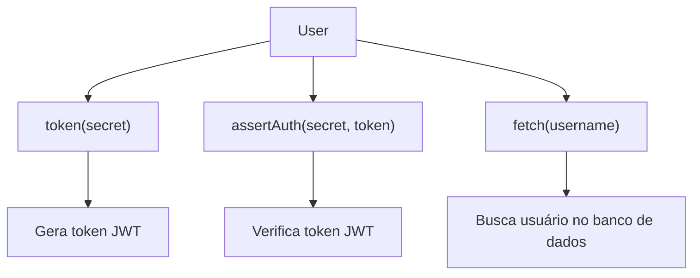
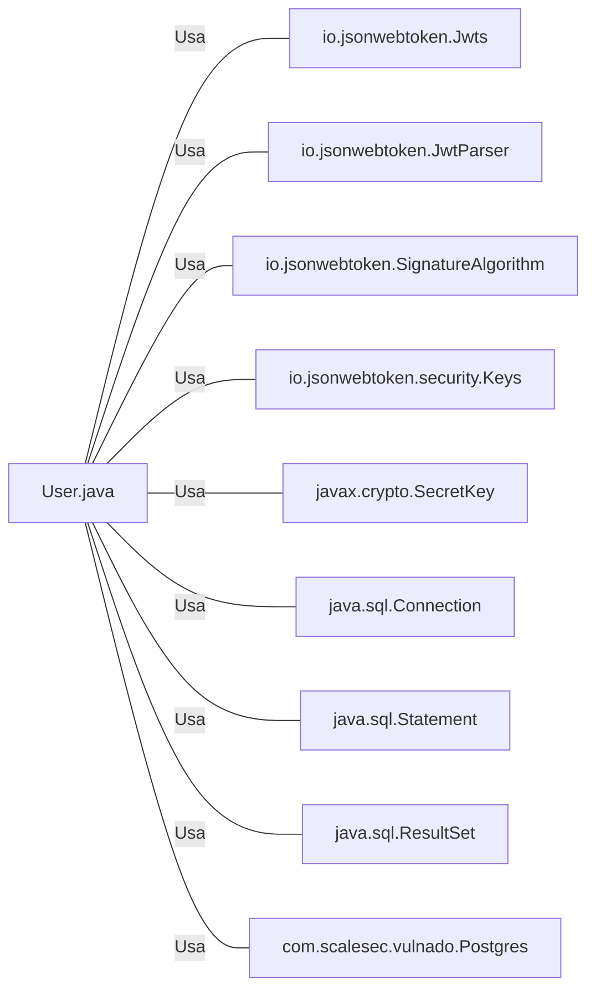

# User.java: Gerenciamento de Usuários

## Visão Geral
O código é responsável pelo gerenciamento de usuários, incluindo a criação de tokens de autenticação, verificação de autenticação e recuperação de informações do usuário a partir de um banco de dados.

## Fluxo do Processo

## Insights
- A classe `User` possui três atributos: `id`, `username` e `hashedPassword`.
- A classe `User` possui três métodos principais: `token`, `assertAuth` e `fetch`.
- O método `token` gera um token JWT para o usuário.
- O método `assertAuth` verifica a autenticidade de um token JWT.
- O método `fetch` recupera informações do usuário a partir de um banco de dados PostgreSQL.

## Dependências (Opcional)

- `io.jsonwebtoken.Jwts` : Utilizado para a criação e verificação de tokens JWT.
- `io.jsonwebtoken.JwtParser` : Utilizado para a verificação de tokens JWT.
- `io.jsonwebtoken.SignatureAlgorithm` : Utilizado para definir o algoritmo de assinatura do token JWT.
- `io.jsonwebtoken.security.Keys` : Utilizado para a criação da chave de assinatura do token JWT.
- `javax.crypto.SecretKey` : Utilizado para a criação da chave de assinatura do token JWT.
- `java.sql.Connection` : Utilizado para estabelecer uma conexão com o banco de dados.
- `java.sql.Statement` : Utilizado para executar consultas SQL.
- `java.sql.ResultSet` : Utilizado para armazenar o resultado de uma consulta SQL.
- `com.scalesec.vulnado.Postgres` : Utilizado para estabelecer uma conexão com o banco de dados PostgreSQL.

## Manipulação de Dados (SQL) (Opcional)
- `users`: A tabela `users` é consultada para recuperar informações do usuário. A operação SQL realizada é SELECT.

## Vulnerabilidades
- O método `fetch` é vulnerável a ataques de injeção SQL, pois a consulta SQL é construída concatenando diretamente a entrada do usuário (`un`). Um atacante pode manipular a entrada para alterar a consulta SQL.
- O método `fetch` não fecha a conexão com o banco de dados e o objeto `Statement` em caso de exceção, o que pode levar a vazamentos de recursos.
- O método `assertAuth` imprime a pilha de exceções no console, o que pode expor informações sensíveis.
