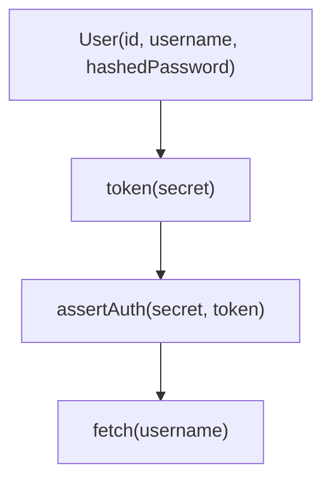
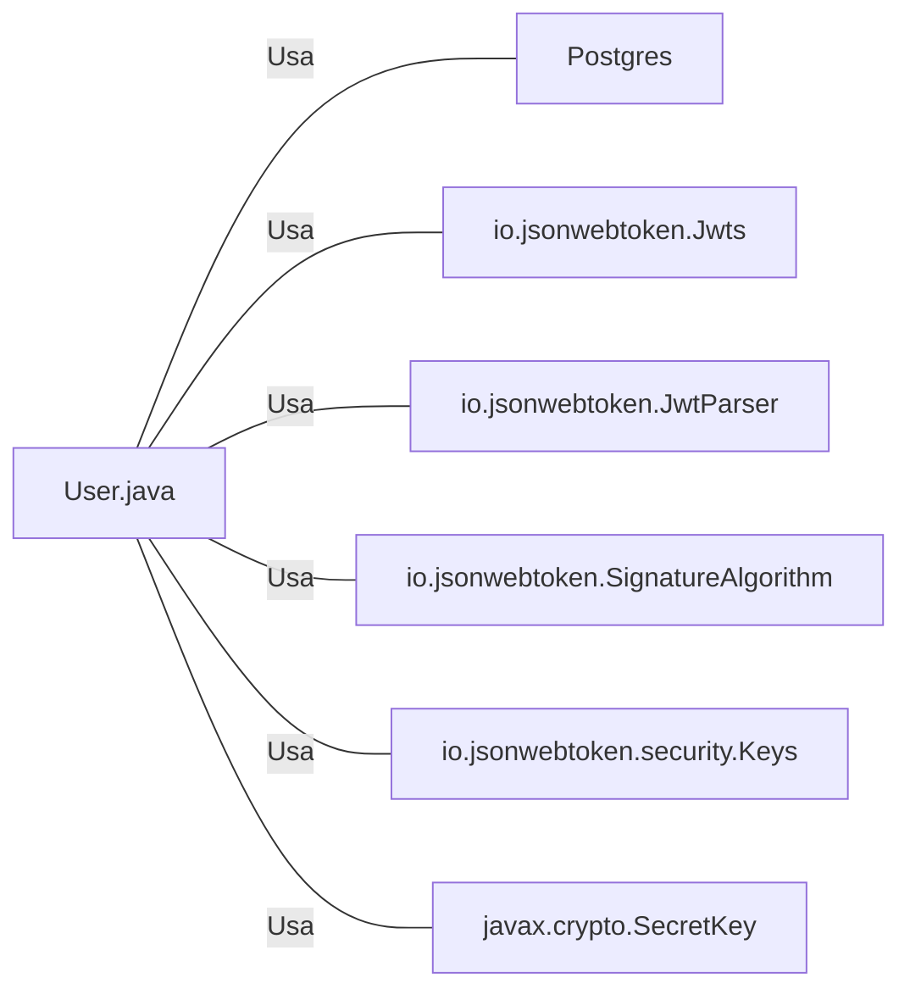

# User.java: Gerenciamento de Usuários

## Visão Geral
O código é responsável pelo gerenciamento de usuários, incluindo a criação de tokens de autenticação, verificação de autenticação e recuperação de informações do usuário a partir de um banco de dados PostgreSQL.

## Fluxo do Processo

## Insights
- A classe `User` possui três atributos: `id`, `username` e `hashedPassword`.
- O método `token` gera um token JWT para o usuário.
- O método `assertAuth` verifica a autenticidade de um token JWT.
- O método `fetch` recupera um usuário do banco de dados PostgreSQL usando o nome de usuário.

## Dependências

- `Postgres`: Classe usada para estabelecer uma conexão com o banco de dados PostgreSQL.
- `io.jsonwebtoken.Jwts`: Biblioteca usada para a criação de tokens JWT.
- `io.jsonwebtoken.JwtParser`: Biblioteca usada para a análise de tokens JWT.
- `io.jsonwebtoken.SignatureAlgorithm`: Biblioteca usada para definir o algoritmo de assinatura do token JWT.
- `io.jsonwebtoken.security.Keys`: Biblioteca usada para a criação de chaves secretas para a assinatura do token JWT.
- `javax.crypto.SecretKey`: Interface usada para representar uma chave secreta.

## Manipulação de Dados (SQL)
- `users`: Tabela do banco de dados PostgreSQL que armazena as informações do usuário. O método `fetch` realiza uma operação de SELECT para recuperar um usuário com base no nome de usuário.

## Vulnerabilidades
- O método `fetch` é vulnerável a ataques de injeção SQL, pois a consulta SQL é construída concatenando diretamente a entrada do usuário. Um atacante pode manipular a entrada para alterar a consulta SQL e acessar dados não autorizados ou realizar ações maliciosas.
- O código não implementa a verificação de erros adequada durante a execução de consultas SQL. Isso pode levar a comportamentos inesperados se ocorrerem erros durante a execução da consulta.
- O código não implementa o fechamento adequado de recursos de banco de dados, como conexões e declarações. Isso pode levar a vazamentos de recursos e afetar o desempenho do aplicativo.
