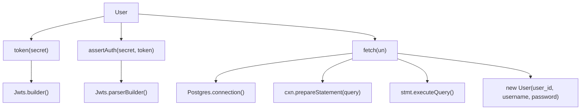
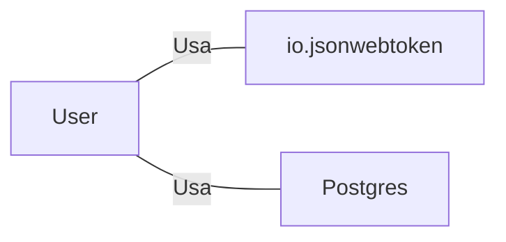

# User.java: Gerenciamento de Usuários

## Visão Geral
O código é responsável pelo gerenciamento de usuários em um sistema, incluindo a criação de tokens de autenticação, verificação de autenticação e recuperação de informações do usuário a partir de um banco de dados PostgreSQL.

## Fluxo do Processo

## Insights
- A classe `User` possui três atributos: `id`, `username` e `hashedPassword`.
- A classe `User` possui três métodos: `token()`, `assertAuth()` e `fetch()`.
- O método `token()` gera um token JWT para o usuário.
- O método `assertAuth()` verifica se um token JWT é válido.
- O método `fetch()` recupera um usuário do banco de dados PostgreSQL.
- A classe `User` interage com a biblioteca `io.jsonwebtoken` para gerar e verificar tokens JWT.
- A classe `User` interage com a classe `Postgres` para estabelecer uma conexão com o banco de dados.

## Dependências

- `io.jsonwebtoken` : Biblioteca usada para gerar e verificar tokens JWT. É usada nos métodos `token()` e `assertAuth()`.
- `Postgres` : Classe usada para estabelecer uma conexão com o banco de dados PostgreSQL. É usada no método `fetch()`.

## Manipulação de Dados (SQL)
- `users`: Tabela do banco de dados PostgreSQL que armazena informações do usuário. É acessada no método `fetch()` para recuperar um usuário.

## Vulnerabilidades
- O método `fetch()` usa uma consulta SQL preparada para recuperar um usuário do banco de dados, o que ajuda a prevenir a injeção de SQL. No entanto, se a entrada do usuário não for adequadamente validada ou sanitizada em outro lugar no código, ainda pode haver um risco de injeção de SQL.
- O método `fetch()` retorna `null` em caso de exceção. Isso pode levar a um comportamento inesperado se o código que chama `fetch()` não verificar se o retorno é `null`.
- O método `assertAuth()` lança uma exceção `Unauthorized` se a verificação do token falhar. No entanto, a mensagem de exceção é a mensagem da exceção original, que pode revelar detalhes sensíveis sobre a implementação do código.
