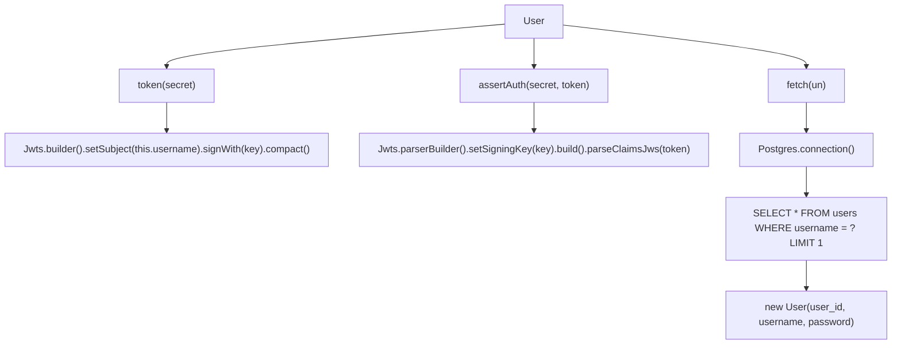
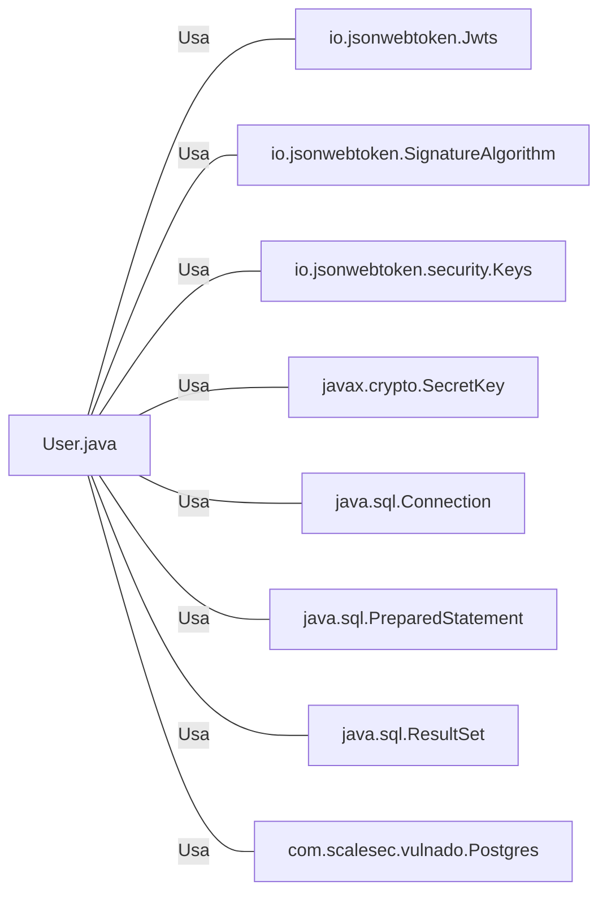

# User.java: Gerenciamento de Usuários

## Visão Geral
O código é responsável pelo gerenciamento de usuários em um sistema, incluindo a criação de tokens de autenticação, verificação de autenticação e recuperação de informações do usuário a partir de um banco de dados PostgreSQL.

## Fluxo do Processo

## Insights
- A classe `User` possui três atributos: `id`, `username` e `hashedPassword`.
- A classe `User` possui três métodos: `token()`, `assertAuth()` e `fetch()`.
- O método `token()` gera um token JWT para o usuário.
- O método `assertAuth()` verifica a autenticidade de um token JWT.
- O método `fetch()` recupera um usuário do banco de dados PostgreSQL.

## Dependências

- `io.jsonwebtoken.Jwts` : Usado para criar e verificar tokens JWT.
- `io.jsonwebtoken.SignatureAlgorithm` : Usado para definir o algoritmo de assinatura do token JWT.
- `io.jsonwebtoken.security.Keys` : Usado para criar a chave de assinatura do token JWT.
- `javax.crypto.SecretKey` : Usado para representar a chave de assinatura do token JWT.
- `java.sql.Connection` : Usado para estabelecer uma conexão com o banco de dados PostgreSQL.
- `java.sql.PreparedStatement` : Usado para preparar e executar a consulta SQL.
- `java.sql.ResultSet` : Usado para armazenar o resultado da consulta SQL.
- `com.scalesec.vulnado.Postgres` : Usado para obter uma conexão com o banco de dados PostgreSQL.

## Manipulação de Dados (SQL)
- `users`: A tabela `users` é consultada para recuperar um usuário com base no nome de usuário. A operação SQL realizada é SELECT.

## Vulnerabilidades
- O código não implementa nenhum mecanismo de hashing ou salting para senhas, o que é uma prática de segurança recomendada. Isso pode levar a vulnerabilidades se um invasor obtiver acesso ao banco de dados.
- O código não implementa nenhum mecanismo para lidar com tentativas de injeção SQL. Isso pode levar a vulnerabilidades se um invasor tentar injetar código SQL malicioso através do parâmetro `un` no método `fetch()`.
- O código não implementa nenhum mecanismo para lidar com erros de conexão com o banco de dados. Isso pode levar a interrupções do serviço se a conexão com o banco de dados for perdida.
- O código não implementa nenhum mecanismo para lidar com usuários não encontrados na consulta SQL. Isso pode levar a erros se um nome de usuário não existente for fornecido ao método `fetch()`.
