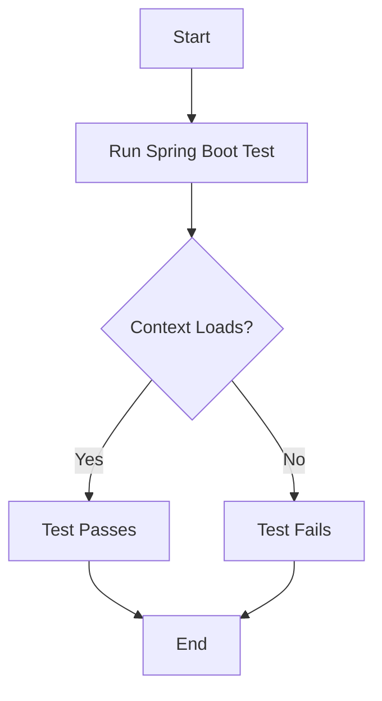
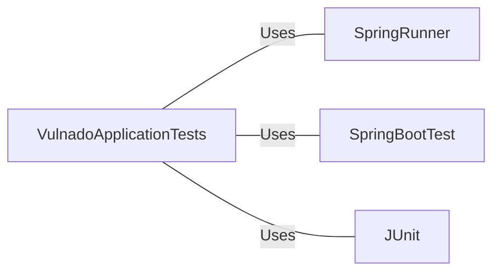

# VulnadoApplicationTests.java: Spring Boot Application Test Configuration

## Overview

This file defines a basic Spring Boot test configuration for the Vulnado application. It ensures that the application context loads successfully.

## Process Flow

## Insights

- Uses Spring Boot's testing framework
- Implements a single test method to verify if the application context loads correctly
- Utilizes JUnit 4 for test execution

## Dependencies

- `SpringRunner`: JUnit runner for integrating Spring TestContext Framework into JUnit 4
- `SpringBootTest`: Annotation for creating a full application context for integration tests
- `JUnit`: Testing framework used for writing and running the test
